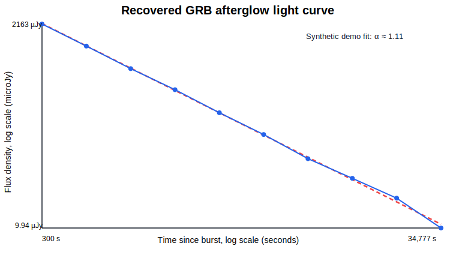
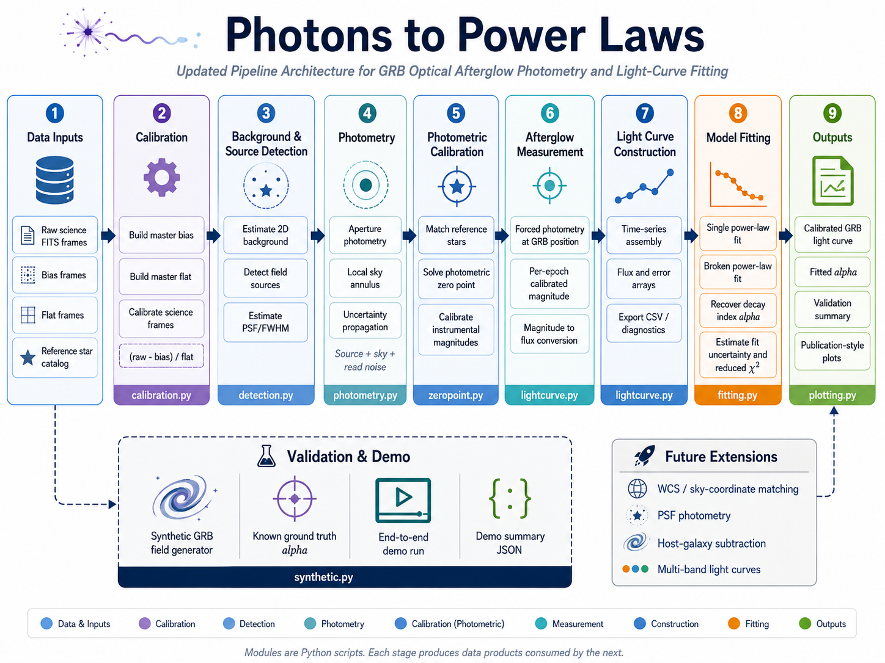

<div align="center">

# Photons to Power Laws

### Decoding the Decay: An Optical Photometry Pipeline for Gamma-Ray Burst Afterglows

From raw telescope frames to calibrated photometry, light-curve construction, and power-law decay fitting.

[](https://github.com/Harishik/photons-to-power-laws/actions/workflows/ci.yml)


</div>

<p align="center">
  
</p>

<div align="center">

**Demo result:** injected decay index `α = 1.10`, recovered `α = 1.11 ± 0.004`, reduced `χ² ≈ 1.0`.

</div>

---

## Overview

**Photons to Power Laws** is a compact, research-oriented Python pipeline that demonstrates how optical Gamma-Ray Burst afterglow observations can be reduced from detector images into physical light-curve measurements.

The project covers the full workflow:

1. calibrate raw optical frames with master bias and master flat frames,
2. detect field sources and estimate local background,
3. perform aperture photometry with propagated uncertainties,
4. solve a robust photometric zero point from reference stars,
5. build a calibrated afterglow light curve, and
6. fit the temporal power-law decay `F(t) ∝ t^(-α)`.

The repository ships with a synthetic GRB field generator, so the whole pipeline can be tested end-to-end without downloading external telescope data.

## Why this matters

Gamma-Ray Bursts are among the most energetic explosions in the universe. Their optical afterglows fade rapidly, often following a power law in time. Measuring the temporal decay index `α` helps connect observed light curves to the physics of relativistic jets, synchrotron emission, shock microphysics, and possible jet breaks.

This project is designed to make that transformation explicit. It is not just a plotting script. It is a transparent, modular reduction pipeline that shows how raw pixels become a fitted physical parameter.

## Key features

- **End-to-end workflow:** raw frames to calibrated light curve and fitted decay index.
- **Synthetic validation:** built-in data generator with known ground truth.
- **Uncertainty-aware photometry:** source, sky, and read-noise terms are included in the error budget.
- **Robust zero-point calibration:** field-star matching with sigma-clipped zero-point estimation.
- **Afterglow-focused fitting:** single and smoothly broken power-law models.
- **Readable research code:** small modules, clear responsibilities, and tests for each stage.
- **CI-ready:** GitHub Actions workflow runs tests and an end-to-end demo smoke test.

## Pipeline architecture

<p align="center">
  
</p>

The architecture follows a modular left-to-right reduction flow. Each Python module produces a data product consumed by the next stage, while the synthetic generator supports end-to-end validation with known ground-truth `α`.

## Repository structure

```text
photons-to-power-laws/
├── src/grb_afterglow/        # Core Python package
│   ├── calibration.py        # Bias, flat, FITS I/O helpers
│   ├── detection.py          # Background estimation and source detection
│   ├── photometry.py         # Aperture photometry and noise propagation
│   ├── zeropoint.py          # Catalog matching and zero-point calibration
│   ├── lightcurve.py         # Light-curve container and magnitude/flux conversion
│   ├── fitting.py            # Single and broken power-law fitting
│   ├── plotting.py           # Publication-style diagnostic plots
│   └── synthetic.py          # Synthetic GRB field generator
├── scripts/run_demo.py       # Full end-to-end demonstration
├── tests/                    # Unit and pipeline tests
├── examples/                 # Demo outputs and viewable figures
├── docs/                     # Science background and notes
└── .github/workflows/ci.yml  # Continuous integration workflow
```

## Installation

Clone the repository and install the required scientific Python stack:

```bash
git clone https://github.com/Harishik/photons-to-power-laws.git
cd photons-to-power-laws

python -m venv .venv
source .venv/bin/activate

pip install -r requirements.txt
pip install -e ".[dev]"
```

On Windows PowerShell, activate the environment with:

```powershell
.venv\Scripts\Activate.ps1
```

## Run the demo

```bash
python scripts/run_demo.py
```

The demo will:

- generate synthetic bias, flat, and science FITS frames,
- inject a fading GRB afterglow with known `α`,
- calibrate the frames,
- detect field stars,
- solve a photometric zero point,
- force photometry at the afterglow position,
- fit the afterglow decay, and
- write outputs to `examples/`.

Expected outputs:

```text
examples/lightcurve.csv
examples/demo_summary.json
examples/lightcurve.png
examples/zeropoint_solution.png
```

The README preview uses `examples/lightcurve.svg` so the figure renders directly on GitHub.

## Current validation result

| Metric | Value |
|---|---:|
| Injected temporal decay index | `1.10` |
| Recovered temporal decay index | `1.1065` |
| Fitted uncertainty | `0.0039` |
| Absolute deviation | `0.0065` |
| Reduced χ² | `1.031` |
| Number of epochs | `10` |
| Validation status | `PASS` |

This validation is synthetic, but it is useful because the ground truth is known. It checks that the pipeline can recover the correct power-law decay when the detector model, photometric calibration, and measurement noise are controlled.

## Minimal API example

```python
from grb_afterglow import (
    LightCurve,
    calibrate_frame,
    detect_sources,
    aperture_photometry_at,
    compute_zeropoint,
    calibrate_magnitudes,
    fit_single_power_law,
)
from grb_afterglow.calibration import load_fits

raw, header = load_fits("science_0001.fits")
calibrated = calibrate_frame(
    raw,
    master_bias=master_bias,
    master_flat=master_flat,
)

sources = detect_sources(calibrated, fwhm=3.5, threshold_sigma=5.0)

# After solving the zero point and measuring the afterglow across epochs:
light_curve = LightCurve(time_s, calibrated_mag, calibrated_mag_err)
fit = fit_single_power_law(light_curve.time, light_curve.flux, light_curve.flux_err)

print(fit.summary())
```

## Scientific scope

The current version focuses on a clean single-band optical workflow. It is suitable for education, prototyping, and method development. For publication-grade reductions on real telescope data, the next required steps are WCS-aware catalog matching, PSF photometry, image stacking, host-galaxy subtraction, and real survey catalog adapters.

## Roadmap

- [x] Core reduction, photometry, calibration, light curve, and fitting pipeline
- [x] Synthetic GRB field generator with known ground truth
- [x] Single and broken power-law fitting
- [x] GitHub Actions CI workflow
- [ ] `astroquery` adapters for Pan-STARRS, SDSS, and Gaia
- [ ] WCS-based sky-coordinate matching in the demo path
- [ ] PSF photometry option with `photutils.psf`
- [ ] Image differencing for host-galaxy subtraction
- [ ] Multi-band light curves and colour evolution
- [ ] Closure-relation diagnostics using temporal and spectral slopes
- [ ] Notebook walkthrough using a real public GRB afterglow dataset

## Testing

Run the test suite with:

```bash
pytest -q
```

The CI workflow also runs the end-to-end demo as a smoke test.

## Documentation

- [Science background](docs/science_background.md)
- [Changelog](CHANGELOG.md)
- [Contributing guide](CONTRIBUTING.md)
- [Citation metadata](CITATION.cff)

## Citation

If this project helps your work, cite the repository using the metadata in `CITATION.cff`.

```bibtex
@software{photons_to_power_laws_2026,
  title  = {Photons to Power Laws: An Optical Photometry Pipeline for Gamma-Ray Burst Afterglows},
  year   = {2026},
  url    = {https://github.com/Harishik/photons-to-power-laws},
  license = {MIT}
}
```

## Contributing

Contributions are welcome. Good first areas include catalog adapters, WCS matching, PSF photometry, and a real-data tutorial notebook. See [CONTRIBUTING.md](CONTRIBUTING.md) before opening a pull request.

## License

This project is released under the MIT License. See [LICENSE](LICENSE).

## Acknowledgments

Built on the Astropy ecosystem, especially `astropy` and `photutils`. The reduction design follows standard optical afterglow practice: calibration, source detection, field-star zero-point calibration, forced photometry at the burst position, and temporal power-law fitting.
